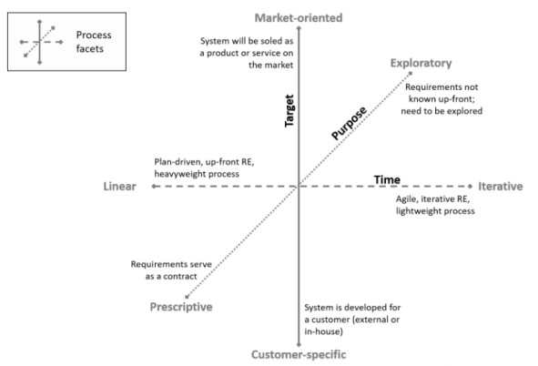
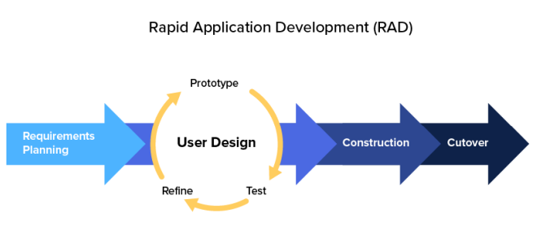

# Processo de Desenvolvimento

## GUPTA

Gupta (2008)¹ propõe que a escolha da abordagem de desenvolvimento de software deve ser baseada em critérios como as necessidades e requisitos do projeto, o ambiente e cultura organizacional em que o projeto será executado, o tamanho e complexidade do projeto, o risco envolvido, o orçamento e o prazo para conclusão do projeto. Ele enfatiza que a escolha da abordagem não é uma decisão única e estática, mas sim um processo contínuo que deve ser revisado e adaptado ao longo do tempo para garantir o sucesso do projeto.

### Características dos Requisitos

| Requerimentos | Waterfall | Prototype | Iterative Enhancement | Evolutionary development | Spiral | RAD |
|:---|:---:|:---:|:---:|:---:|:---:|:---:|
|Os requisitos são facilmente compreensíveis e definidos? (SIM)| Sim | Não | Não | Não | Não | Sim |
|Mudamos os requisitos com bastante frequência? (NÃO)| Sim | Não | Sim | Sim | Não | Sim |
|Podemos mudar os requisitos no início do ciclo? (SIM)| Sim | Não | Sim | Sim | Não  | Sim |
|Os requisitos indicam um sistema complexo a ser construído? (NÃO)| Sim | Não | Não | Não | Não | Sim |

### Status da Equipe de Desenvolvimento

|Requerimentos | Waterfall | Prototype | Iterative Enhancement | Evolutionary development | Spiral | RAD |
|:---|:---:|:---:|:---:|:---:|:---:|:---:|
|Menos experiência em projetos similares(SIM) | Não | Sim | Não | Não | Sim | Não |
|Menos conhecimento de domínio (novidade na tecnologia) (NÃO) | Não | Sim | Não | Não | Não | Sim |
|Menos experiência nas ferramentas a serem utilizadas (NÃO) | Não | Sim | Sim | Sim | Não | Sim |
|Disponibilidade de treinamento, se necessário(SIM) | Não | Não | Sim | Sim | Não | Sim |

### Envolvimento do Usuário

|Requerimentos | Waterfall | Prototype | Iterative Enhancement | Evolutionary development | Spiral | RAD |
|:---|:---:|:---:|:---:|:---:|:---:|:---:|
|Envolvimento do usuário em todas as fases (NÃO) | Sim | Não | Sim | Sim | Sim | Não |
|Participação limitada do usuário(SIM) | Sim | Não | Sim | Sim | Sim | Não |
|O usuário não tem experiência prévia de participação em projeto semelhante(SIM)| Não | Sim | Sim | Sim | Sim | Não |
|Os usuários são especialistas no domínio do problema (NÃO) | Sim | Não | Não | Sim | Sim | Não |

### Tipo de Projeto e Risco Associado

|Requerimentos | Waterfall | Prototype | Iterative Enhancement | Evolutionary development | Spiral | RAD |
|:---|:---:|:---:|:---:|:---:|:---:|:---:|
|O projeto é aprimoramento do sistema existente (NÃO)| Sim | Sim | Não | Não | Sim | Não |
|O financiamento é estável para o projeto(SIM)| Sim | Sim | Não | Não | Não | Sim |
|Altos requisitos de confiabilidade(SIM)| Não | Não | Sim | Sim | Sim  | Não |
|Cronograma do projeto apertado(SIM)| Não | Sim | Sim | Sim | Sim | Sim |
|Uso de componentes reutilizáveis(NÃO)| Sim | Não | Sim | Sim | Não | Não |
|Os recursos (tempo, dinheiro, pessoas etc.) são escassos?(SIM)| Não | Sim | Não | Não | Sim | Não |

## Facetas

As Facetas do processo de Engenharia de Requisitos são encontradas no IREB (2022)², e serve para poder identificar quais são as características dos requisitos do projeto, na figura 1, observa-se a estrutura do diagrama e quais pontos devem ser levados em consideração.

Figura 1 - Facetas do processo de ER (Fonte: International Requirements Engineering Board, 2022)

Através de uma análise cuidadosa, a equipe chegou na conclusão que as características do projeto se encaixam na seguinte descrição 

### Customer-specific

O produto é encomendado por um cliente e desenvolvido por um fornecedor para este cliente. Critério de seleção:

- Pessoas individuais identificáveis para todas as funções das partes interessadas;
- As partes interessadas do lado do cliente são a principal fonte de requisitos;
- O relacionamento contratual do fornecedor do cliente afeta o processo;

### Iterativo

- Requisitos em evolução - não conhecidos antecipadamente;
- Curtos ciclos de feedback estabelecidos para mitigar o risco;
- Longa duração do projeto;
- A capacidade de alterar os requisitos facilmente é importante;

## RAD (Rapid Application Development)

Levando em consideração o resultado do GUPTA e as características das Facetas do Processo de Engenharia de Requisitos que se enquadram no projeto e utilizando as configurações citadas por Martin Glin³, escolhemos o RAD para trabalhar ao longo do desenvolvimento.  

RAD é uma estratégia de desenvolvimento ágil que prioriza a velocidade da execução do desenvolvimento de produto, busca minimizar a fase de planejamento e enfatizar o desenvolvimento de protótipos com a validação do o cliente, os requisitos são tratados como variáveis, na figura 2 observa-se como funciona o RAD.

Figura 2 - Rapid Application Development (Fonte: [Kissflow](https://kissflow.com/application-development/rad/rapid-application-development/), Acesso 26 de Abril de 2023)

## Atividade 1

| **Atividade**           | **Método** | **Ferramenta**  | **Entrega**            |
|:-----------------------:|:----------:|:---------------:|:----------------------:|
| Definição de Requisitos | Kanban     | GitHub Projects | Conjunto de Requisitos |

## Atividade 2

| **Atividade** | **Método**      | **Ferramenta** | **Entrega**                  |
|:-------------:|:---------------:|:--------------:|:----------------------------:|
| Prototipação  | Mock-up digital | Figma          | Protótipo de alta fidelidade |

## Atividade 3

| **Atividade**   | **Método** | **Ferramenta**  | **Entrega** |
|:---------------:|:----------:|:---------------:|:-----------:|
| Desenvolvimento | Lean       | VS Code, Github | Produto     |

## Atividade 4

| **Atividade** | **Método**       | **Ferramenta** | **Entrega**     |
|:-------------:|:----------------:|:--------------:|:---------------:|
| Testagem      | Testes Unitários | Unittest       | Produto testado |

## Referências Bibliográficas

> ¹ GUPTA, S. Managing Iterative Software Development Projects. Auerbach Publications, 2008. 
> ² INTERNATIONAL REQUIREMENTS ENGINEERING BOARD. Handbook IREB CPRE Foundation Level, Version 1.1.0, september 2022. [S.l.]: International Requirements Engineering Board, 2022. 
> ³ GLIN, Martin. Requirements Engineering I – Part II: RE Practices. [S.l.]: Martin Glin, 2019.
