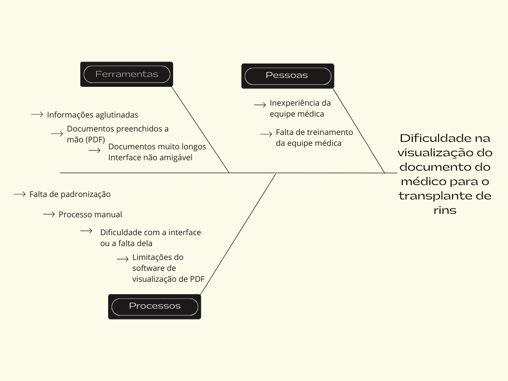

# Visão Geral do Produto

## Histórico de Revisão

| **Data** | **Versão** | **Descrição**                                              | **Autor**                               |
|:--------:|:----------:|:----------------------------------------------------------:|:---------------------------------------:|
| 25/04    | 1.0        | Criação das seções de visão geral do produto e do projeto. | Ana Beatriz, Bruno, Gabriel, João Pedro |

## Problema

De acordo com o [portal oficial do Governo Federal](http://gov.br), o Hospital Universitário de Brasília [HUB](https://www.gov.br/ebserh/pt-br/hospitais-universitarios/regiao-centro-oeste/hub-unb) é referência nacional no que tange à área médica de transplantes: “Em 2014, a instituição contabilizou 36 transplantes de rins. Já o primeiro transplante de córnea ocorreu em 2008. Até o momento, o hospital soma 466 cirurgias realizadas, sendo 63 delas feitas só no ano passado. O Hospital Universitário possui, desde 2010, programas de residência médica em urologia e em nefrologia com área de atuação em transplantes renais, sendo o único centro de formação de residência médica em transplante das regiões Centro‑Oeste e Norte do país”¹.  
No entanto, o HUB possui alguns empecilhos de ordem estrutural (tecnológica) e técnica que inviabilizam o processo de transplantes. Em relação àquele, um problema notável é a  dificuldade de análise dos dados referentes aos órgãos a serem transplantados. A documentação que contém essas informações é enviada em formato PDF, o que torna a visualização e análise dos dados bastante aglomerada, confusa e não padronizada.  
Em consequência, essa situação acaba gerando um grande impacto no tempo necessário para que a equipe médica possa analisar e tomar a decisão sobre a aceitação ou não do órgão. Além disso, essa demora pode ser extremamente prejudicial ao paciente que aguarda o transplante, pois quanto mais tempo demora para que o órgão seja aceito, maiores são as chances de que ele seja comprometido e, portanto, inviável para o transplante. Esta problemática pode ser visualizada abaixo por intermédio do diagrama de Ishikawa (Figura 1):  

Figura 1 - Diagrama de Ishikawa (Fonte: Autor, 2023)

## Declaração de Posição do Produto

À vista destas coisas, a proposta é desenvolver um software exclusivo que irá simplificar e agilizar o processo de análise dos dados referentes aos órgãos a serem transplantados, tornando-o mais eficiente e seguro para a equipe médica e pacientes.  
O que torna nosso produto exclusivo é a sua capacidade única de extrair os dados necessários a partir de arquivos PDF, permitindo que a equipe médica possa analisá-los de maneira mais rápida e precisa através de visualizações simplificadas  eficazes (e.g., painéis de controle e dashboards) que atendam aos princípios de usabilidade e praticidade.  
Os usuários-alvo e clientes do nosso produto são as equipes médicas que trabalham no HUB no setor de cirurgias e transplantes de órgãos.  
Eles devem utilizar nosso software porque ele irá simplificar e agilizar o processo de análise dos dados dos órgãos a serem transplantados, permitindo que a equipe possa tomar decisões mais rápidas e precisas, reduzindo assim o tempo de espera dos pacientes por um órgão compatível e aumentando as chances de sucesso no transplante. Além disso, o nosso software pode reduzir o risco de erro humano e melhorar a eficiência do processo como um todo.  
Uma alternativa competitiva primária seria a contratação de uma equipe especializada em análise de dados médicos para realizar a leitura e organização dos dados dos órgãos a serem transplantados. Essa equipe poderia utilizar métodos manuais ou softwares de análise de dados para realizar essa tarefa. No entanto, essa opção pode ser mais dispendiosa e menos eficiente do que a utilização do nosso software exclusivo, que foi projetado especificamente para esse propósito e pode processar os dados de maneira muito mais rápida e precisa.  
A solução pode ser condensada no seguinte quadro-resumo (Tabela 1):  

|                      |                                                                                                                                                                                                                                                                                                     |
|:--------------------:|:---------------------------------------------------------------------------------------------------------------------------------------------------------------------------------------------------------------------------------------------------------------------------------------------------:|
| **Para**             | Equipes médicas e funcionários do HUB que trabalham no processo de transplantes de órgãos e cirurgias.                                                                                                                                                                                              |
| **Quem**             | simplificar e agilizar o processo de análise dos dados referentes aos órgãos a serem transplantados, tornando-o mais eficiente e seguro para a equipe médica e pacientes.                                                                                                                           |
| **O FastTransplant** | é um produto de software destinado à área médica.                                                                                                                                                                                                                                                   |
| **Que**              | possui a capacidade única de extrair os dados necessários a partir de arquivos PDF, permitindo que a equipe médica possa analisá-los de maneira mais rápida e precisa, além de comparar informações médicas de diferentes doadores e pacientes cadastrados em uma base de dados.                    |
| **Ao contrário**     | para os médicos, conferir um relatório com dados de um doador vivo/falecido se tornaria algo estressante (e. g.,  informações aglutinadas, falta de padronização) e  manual - sem contar a maior possibilidade de haver erros humanos.                                                              |
| **Nosso produto**    | abre a possibilidade para uma solução menos custosa, porém sem deixar de lado a segurança e a praticidade, evitando gastos excessivos como a contratação de uma equipe especializada em análise de dados médicos para realizar a leitura e organização dos dados dos órgãos a serem transplantados. |

Tabela 1 - Quadro-resumo da solução (Fonte: Autor, 2023)

## Objetivos do Produto

O propósito principal do projeto é desenvolver um software exclusivo que permita a extração e organização dos dados contidos em arquivos PDF relacionados aos órgãos a serem transplantados, a fim de tornar o processo de análise mais eficiente e seguro para a equipe médica e pacientes.  
Os objetivos secundários incluem o desenvolvimento de uma maneira de gerar dados de compatibilidade entre os órgãos doadores e os pacientes que estão na lista de espera, além de garantir a segurança e privacidade dos dados dos pacientes, implementando medidas de segurança avançadas para proteger as informações sensíveis dos pacientes.  
Prima-se pela compatibilidade do software com os sistemas existentes do hospital ou clínica, a fim de permitir uma fácil integração com o fluxo de trabalho existente.

## Tecnologias a serem Utilizadas

Linguagens de programação: Python e Javascript 
Front-end: React.js 
Back-end: Django 
Banco de dados: MongoDB 

## Referências

 ¹ Hospital Universitário de Brasília (HUB) é destaque por transplantes realizados. Disponível em: <https://www.gov.br/ebserh/pt-br/hospitais-universitarios/regiao-centro-oeste/hub-unb/comunicacao/noticias/hub-e-destaque-por-transplantes-realizados>. Acesso em: 25 abr. 2023.
